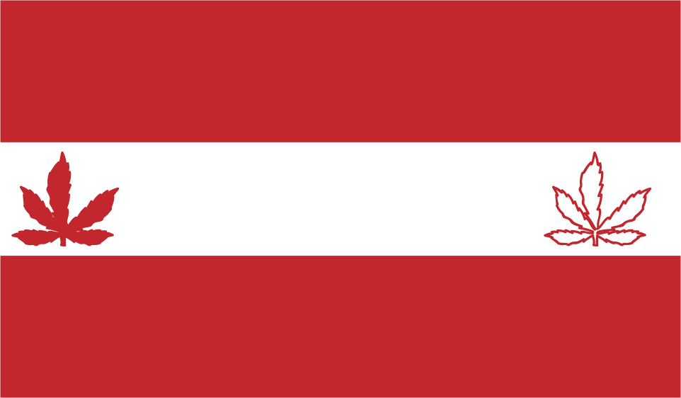
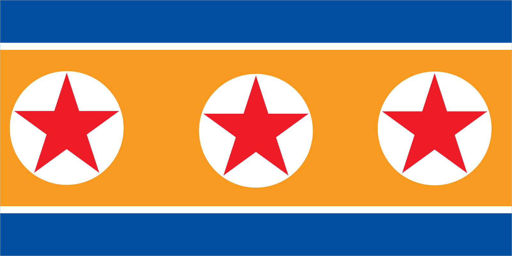

**The Union Hack Team Repository**

*Rajeevs Pics*

The green patch symbolises Britain being an island in the sea(blue background). Ive also used the colours of the union jack to represent the British isles. And stars to represent royalty.

The flag uses the same colours as the Canadian flag however the stripes on the original Canadian flag were vertical I changed them to make them horizontal and put two leaves instead of one, there are two different types of the same leaf to show changing seasons.

For this flag I decided to use the same colours as the greek flag, but I used a lighter shade of blue to give it a more modern look and also make it look like the colours of the sea and sky.

I changed the red in middle of the flag to orange to give the star more contrast as it is also red. I also copied the star on the flag twice this was to make it look more distinctive than the original.
 

*Joe's Pics*

